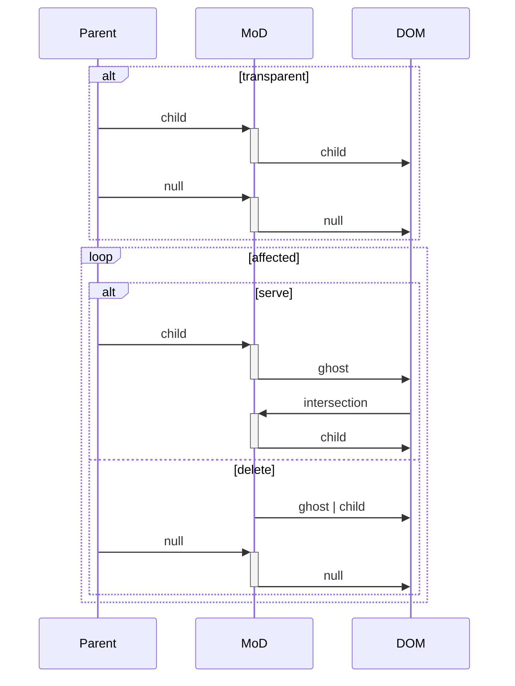
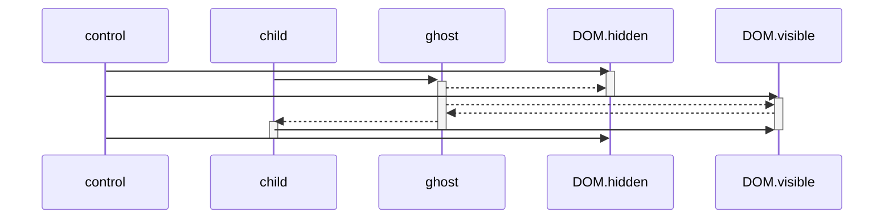
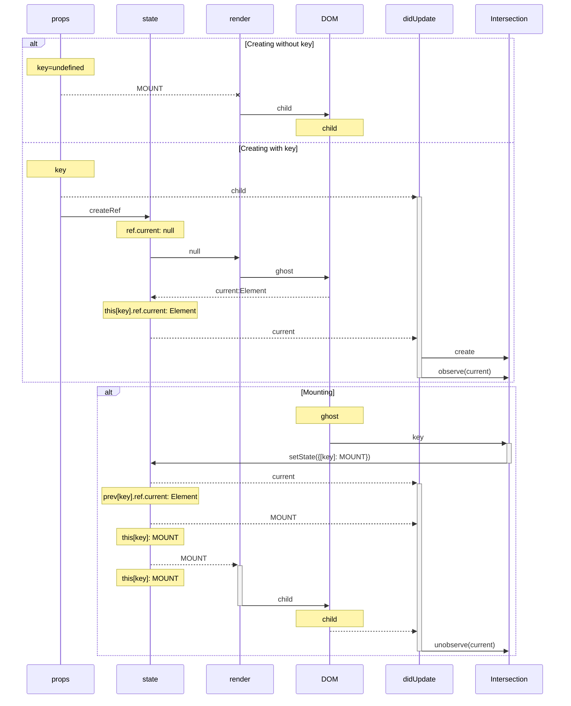
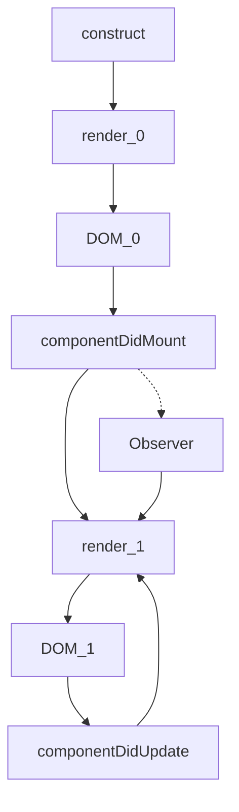

[[_TOC_]]

## Scenarios 

Child identification only by `key`

```mermaid
sequenceDiagram
participant Parent
participant MoD
participant DOM

alt transparent
Parent ->> +MoD: child
MoD ->> -DOM: child
Parent ->> +MoD: null
MoD ->> -DOM: null
end

loop affected
alt serve
Parent ->> +MoD: child
MoD ->> -DOM: ghost
DOM ->> +MoD: intersection
MoD ->> -DOM: child
else delete
MoD ->> DOM: ghost | child
Parent ->> +MoD: null
MoD ->> -DOM: null
end
end
```

### Dynamic test

```mermaid
sequenceDiagram
participant control
participant child
participant ghost
participant hidden as DOM.hidden
participant visible as DOM.visible

control ->> hidden: 
activate hidden

child ->> +ghost:  
ghost -->> hidden: 

control ->> visible: 
deactivate hidden
activate visible
ghost -->> visible: 
visible -->> ghost: 
ghost -->> child: 
child ->> visible: 
deactivate ghost
activate child

deactivate visible
control ->> hidden: 
activate hidden

deactivate child

```

## Data

```mermaid
sequenceDiagram
participant props
participant state
participant render
participant DOM
participant didUpdate
participant Intersection

alt Creating without key
  Note over props: key=undefined
  props--x render: MOUNT
  render->>DOM: child
  Note over DOM: child
else Creating with key
  Note over props: key
  props-->>+didUpdate: child
  props->>state: createRef
  Note over state: ref.current: null
  state->>render: null
  render->>DOM: ghost
  DOM-->>state: current:Element
  Note over state: this[key].ref.current: Element
  state-->>didUpdate: current
  didUpdate->>Intersection: create
  didUpdate->>-Intersection: observe(current)
end


alt Mounting
  Note over DOM: ghost
  DOM->>+Intersection: key
  Intersection->>-state: setState({[key]: MOUNT})
  state-->>+didUpdate: current 
  Note over state: prev[key].ref.current: Element

  state-->>didUpdate: MOUNT
  Note over state: this[key]: MOUNT
  state-->>+render: MOUNT
  Note over state: this[key]: MOUNT

  render->>-DOM: child
  Note over DOM: child

  DOM-->>didUpdate: 
  didUpdate->>-Intersection: unobserve(current)
end
```

## Flow

```mermaid
graph TB

construct
render_0
DOM_0
componentDidMount
Observer
render_1
DOM_1
componentDidUpdate

construct --> render_0 --> DOM_0 --> componentDidMount

componentDidMount -.-> Observer
componentDidMount --> render_1
Observer --> render_1 --> DOM_1 --> componentDidUpdate
componentDidUpdate --> render_1

```